# ZeffUI
A FFXIV Overlay for OverlayPlugin using HTML and JS

1. [About](#about)
1. [Installing](#installing)

## About

ZeffUI is an ACT overlay that provides  for [Final Fantasy XIV](http://www.finalfantasyxiv.com/). This project uses [cactbot](https://github.com/quisquous/cactbot/) and [ngld's OverlayPlugin](https://github.com/ngld/OverlayPlugin)
which are plugins for
[Advanced Combat Tracker](http://advancedcombattracker.com/).

ZeffUI is currently pretty customizeable and I'm hoping it's only going to get better!

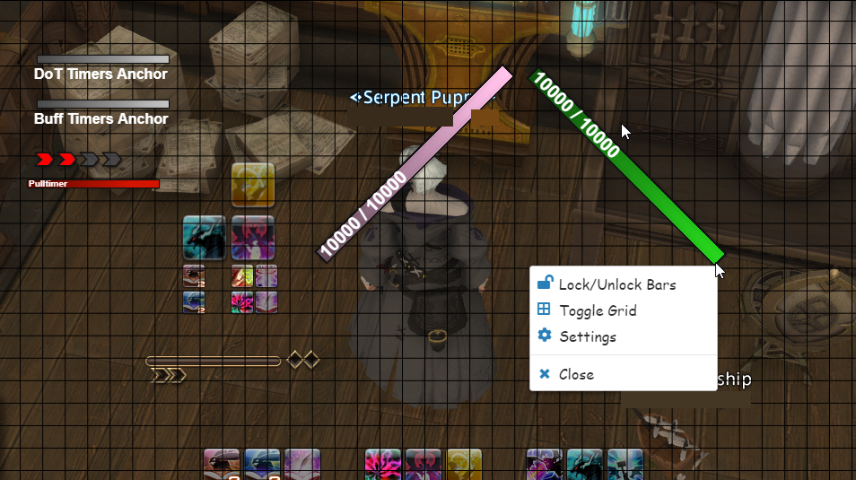

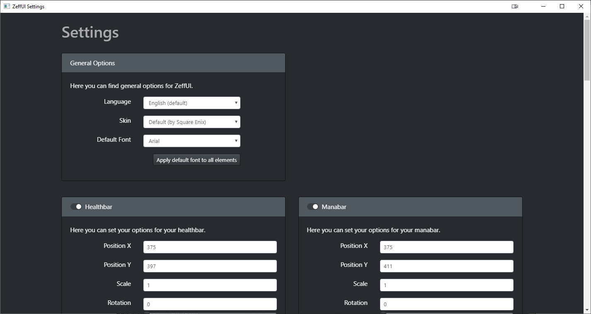

ZeffUI currently has these modules built in: 

* Health and Manabars

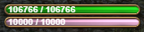

* Pulltimer

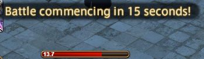

* DoT Timers

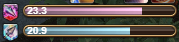

* Buff Timers

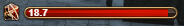

* Raidbuff Cooldowns

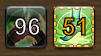

* Mitigation Cooldowns for Tanks

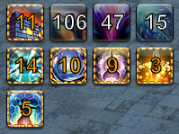

* Stacks for certain classes (like Ruin IV stacks for SMN)

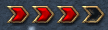

## Installing

### Dependencies

Install [.NET Framework](https://www.microsoft.com/net/download/framework) version 4.6.1 or above.

You must have [DirectX 11](http://imgur.com/TjcnjmG) enabled for Final Fantasy XIV.

Install the 64-bit version of [Advanced Combat Tracker](http://advancedcombattracker.com/), if you have not already.

### Install FFXIV ACT Plugin

If you have just installed ACT,
then you will be presented with a startup wizard.
To get to the startup wizard otherwise,
click on `Options` and then click on `Show Startup Wizard`.

In the startup wizard,
select `FFXIV Parsing Plugin` and then click the `Download/Enable Plugin` button.
This will download `%APPDATA%Advanced Combat Tracker\Plugins\FFXIV_ACT_Plugin.dll`
and enable it in the list of plugins.

Additionally, you must enable parsing from the network and make sure that ACT is not firewalled.
Make sure the settings for the FFXIV plugin have the "Include HP for Triggers" button checked.
This is under `Plugins` ->`FFXIV Settings` -> `Options`.

Alternative FFXIV Plugin Guides:

* [fflogs video guide](https://www.fflogs.com/help/start/)
* [TomRichter guide](https://gist.github.com/TomRichter/e044a3dff5c50024cf514ffb20a201a9#installing-act--ffxiv-plugin)

### Install ngld OverlayPlugin

At this point, if you select the `Plugins` tab and go to the `Plugin Listing`,
your list of plugins should look something like this:

Click on `Get Plugins` to open up the ACT plugin installer.

Select `Overlay Plugin` and then click `Download and Enable`.

This will download the ngld OverlayPlugin into
`%APPDATA%Advanced Combat Tracker\Plugins\OverlayPlugin`
and enable `OverlayPlugin.dll` in the list of plugins.

As a note, you must use the [ngld](https://github.com/ngld) version of
OverlayPlugin and not the original RainbowMage version or the hibiyasleep fork.

### Installing cactbot

Again, go to the `Plugins` tab and go to the `Plugin Listing`,
and then select `Get Plugins`.

Select `Cactbot` and then click `Download and Enable`.

This will download the cactbot into
`%APPDATA%Advanced Combat Tracker\Plugins\cactbot-version\cactbot`
and enable `CactbotOverlay.dll` in the list of plugins.

**Note**: Due to a difference in how ACT expects archives to be
and how cactbot generates its zip files,
there will be something like a `cactbot-0.15.2` folder
that corresponds to the initial version that you downloaded cactbot.
This folder name does not matter and is cosmetic.

Verify your plugins are in the correct order.
The order should be: FFXIV Plugin first, then OverlayPlugin, then cactbot.
If you have followed the above instructions, it should look like the following:

Finally, restart ACT.

## Adding ZeffUI Overlay

Here's how you finally add ZeffUI

1. Open ACT.
1. Make sure you've restarted ACT after adding the cactbot plugin.
1. Navigate to the `Plugins` tab of ACT and then the `OverlayPlugin.dll` tab inside it.
1. Click the "New" button and then pick `ZeffUI` in the Preset list.

    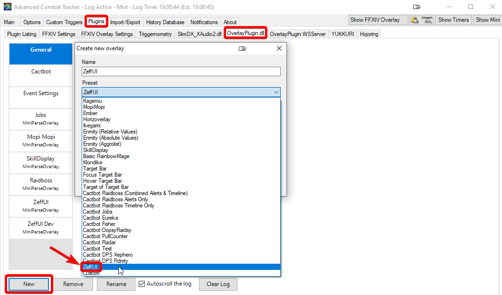

1. At this point you'll see health and manabars
and a blue background to help with resizing and placing overlays on screen.
The blue background will go away when the overlay is locked in the config panel for the overlay.
You should always lock your overlay once you are done resizing and placing it.

    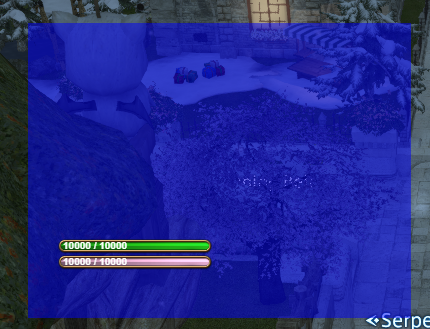

1. Type in any name you'd like as the name of this overlay, e.g. `ZeffUI`.
1. Click the `OK` button to add this as an Overlay.
It will now appear in the list of overlays in the `Plugins` -> `OverlayPlugin.dll` tab.

1. Drag and resize the overlay to the location that you want it in.

1. In the `General` tab of the `ZeffUI` overlay, click the `Lock Overlay` checkbox.
The blue background will disappear once the overlay has been locked.

1. Rightclick either the Healthbar or Manabar element.

    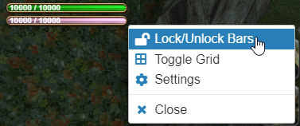

1. If you want you can also toggle the grid to give you an easier time aligning objects.

1. Start moving elements to where you want, note that the anchors for Raidbuffs and Mitigation will only show up on the appropriate classes.

    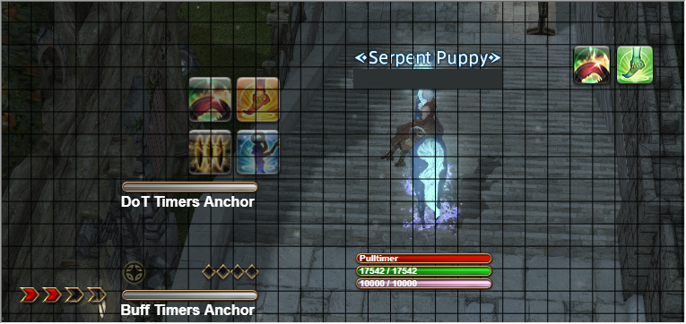

1. After that either lock the bars again or head over to settings to customize your setup.

    
    
1. After that your setup should be complete.

If you need any help either raise an issue or find me on the ACT/Triggernometry Discord servers or DM me directly on Zeffuro#3033
